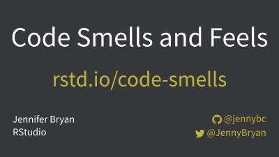

# Code Smells and Feels

Talk for [useR!2018](https://user2018.r-project.org) Brisbane  
by Jenny Bryan  
Twitter: [@jennyBryan](https://twitter.com/jennyBryan/)  
GitHub: [@jennybc](https://github.com/jennybc)  

> "Code smell" is an evocative term for that vague feeling of unease we get when reading certain bits of code. It's not necessarily wrong, but neither is it obviously correct. We may be reluctant to work on such code, because past experience suggests it's going to be fiddly and bug-prone. In contrast, there's another type of code that just feels good to read and work on. What's the difference? If we can be more precise about code smells and feels, we can be intentional about writing code that is easier and more pleasant to work on. I've been fortunate to spend the last couple years embedded in a group of developers working on the tidyverse and r-lib packages. Based on this experience, I'll talk about specific code smells and deodorizing strategies for R.

## Link to this repo

[rstd.io/code-smells](https://rstd.io/code-smells) is a shortlink to HERE

## Slides

Slides [on SpeakerDeck](https://speakerdeck.com/jennybc/putting-square-pegs-in-round-holes-using-list-cols-in-your-dataframe)

Slides [as PDF file](2018-07_user-brisbane.pdf) here in this repo

## Credits and resources

Annotated and hyperlink-y list of resources mentioned in the slides, in roughly the same order.

---

Do useRs have less formal training in CS/programming than others writing code?

2018 Stack Overflow Annual Developer Survey: <https://insights.stackoverflow.com/survey>

Adapted from original code by [Julia Silge](https://juliasilge.com), data scientist at  Stack Overflow.

Code here in this repo: [stackoverflow-survey](stackoverflow-survey)

---

Talks about programming style, workflow, and policies

Some that inspired me:

Good Programming Practice, UseR! 2004 Keynote, Martin Mächler  
http://www.ci.tuwien.ac.at/Conferences/useR-2004/  

What I find important when R Programming and Recent Cool Features in R  
2018 eRum Keynote by Martin Mächler and R Core Team  
http://stat.ethz.ch/~maechler/U/R/eRum_2018_ProgR-ALTREP.html  

My own efforts in this genre:

[Zen And The aRt Of Workflow Maintenance](https://speakerdeck.com/jennybc/zen-and-the-art-of-workflow-maintenance), IASC/NZSA 2017, Jenny Bryan

[Workflow: You should have one](https://speakerdeck.com/jennybc/workflow-you-should-have-one), EARL London 2017, Jenny Bryan

---

Cakes that look like hedgehogs ... sort of?

 * Beautiful hedgehog cake: [BBC goodfood recipe](https://www.bbcgoodfood.com/recipes/hedgehog-cake)
  * Homely hedgehog cake: [Reddit thread](https://www.reddit.com/r/funny/comments/1am3x7/so_a_friend_of_my_girlfriend_made_a_cake_for_her/), <http://i.imgur.com/peilfAh.jpg> 
  * Photos originally found at <https://www.boredpanda.com/funny-cake-fails-expectations-reality/>
  
---

[What Every Successful Person Knows, But Never Says](https://jamesclear.com/ira-glass-failure)  
James Clear blog post that discusses an Ira Glass interview. Indicative quote:

> All of us who do creative work, we get into it because we have good taste. But it's like there is this gap. For the first couple years that you're making stuff, what you're making isn't so good. It’s not that great. It’s trying to be good, it has ambition to be good, but it’s not that good.
>
> But your taste, the thing that got you into the game, is still killer. And your taste is good enough that you can tell that what you're making is kind of a disappointment to you.

---

The teams that bring you

  * tidyverse packages: [org members](https://github.com/orgs/tidyverse/people) and [outside collaborators](https://github.com/orgs/tidyverse/outside-collaborators)
  * r-lib packages: [org members](https://github.com/orgs/r-lib/people) and [outside collaborators](https://github.com/orgs/r-lib/outside-collaborators)
  
---

Refactoring  
Improving the Design of Existing Code  
by Martin Fowler  
(with Kent Beck, John Brant, William Opdyke, and Don Roberts)  
https://martinfowler.com/books/refactoring.html

Dumpster photo by NeONBRAND  
https://unsplash.com/photos/8Yk4T-tDSYY

---

Code Smells – a Short List  
blog post by Arne Mertz  
https://arne-mertz.de/2017/08/code-smells-short-list/

---

bizarro: all code snippets are given here in [R/](R)

Beach + glass orb photo by Perchek Industrie  
https://unsplash.com/photos/y-rmmZZfD1I

---

Good enough practices in scientific computing  
Wilson G, Bryan J, Cranston K, Kitzes J, Nederbragt L, et al. (2017) Good enough practices in scientific computing. PLOS Computational Biology 13(6): e1005510. <https://doi.org/10.1371/journal.pcbi.1005510>

> Do not comment and uncomment sections of code to control a program's behavior.

---

`if() else()` described in breathless AI style:  
you mean a one layer neural network with identity activation and no hidden layers

[Tweet](https://twitter.com/F_Vaggi/status/1011127587639197696) by [Federico Vaggi](https://twitter.com/F_Vaggi)

---

Return early and clearly  
Blog post by Arne Mertz  
https://arne-mertz.de/2016/12/early-return/  
"Handling preconditions" section is the basis of my early return before/after example `get_some_data()`.

More posts and conversations about early returns and avoiding if entirely:

  * [Avoid Else, Return Early](http://blog.timoxley.com/post/47041269194/avoid-else-return-early), blog post by Tim Oxley
  * [Anti-If: The missing patterns](https://code.joejag.com/2016/anti-if-the-missing-patterns.html), blog post by Joe Wright
  * Recent discussion on Hacker News: <https://news.ycombinator.com/item?id=17408836>

Yoda photo by Kory Westerhold on flickr  
https://www.flickr.com/photos/korymatthew/14211839966

---

Baby with diaper photo by rawpixel  
https://unsplash.com/photos/6RjllGKO88U

---

In addition to the **Refactoring** book referenced above, these are other good reads for improving your code:

The Art of Readable Code  
Simple and Practical Techniques for Writing Better Code  
Dustin Boswell, Trevor Foucher  
http://shop.oreilly.com/product/9780596802301.do

The Pragmatic Programmer  
From Journeyman to Master  
by Andrew Hunt and David Thomas  
https://pragprog.com/book/tpp/the-pragmatic-programmer
