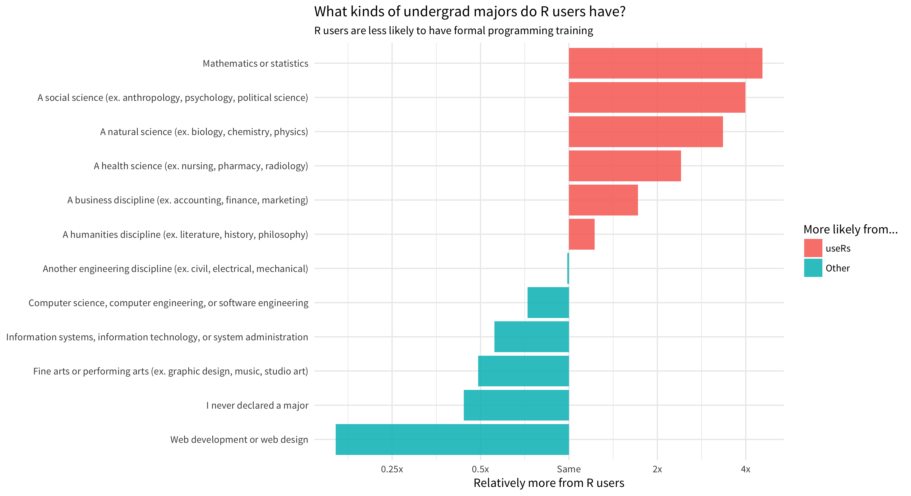
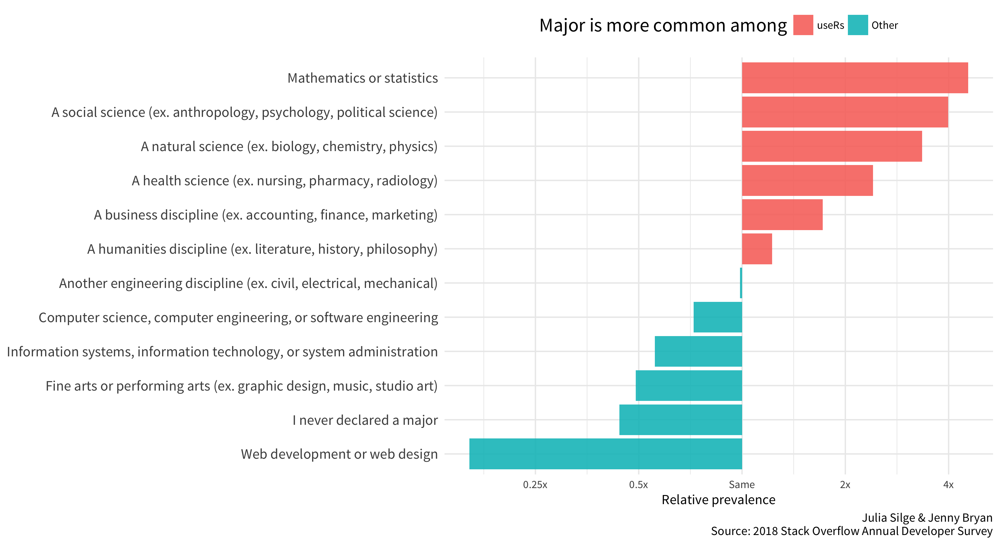

<!-- README.md is generated from README.Rmd. Please edit that file -->

# Stack Overflow survey analysis

Look at evidence for formal training in CS/programming among those who
use R.

Use 2018 Stack Overflow Annual Developer Survey:
<https://insights.stackoverflow.com/survey>

Original code from [Julia Silge](https://juliasilge.com), data scientist
at Stack Overflow. Modified by Jenny Bryan.

## Analysis

Load packages.

``` r
library(here)
#> here() starts at /Users/jenny/talks/2018-07_user-brisbane
library(tidyverse)
#> ── Attaching packages ──────────────────────────────────────── tidyverse 1.2.1 ──
#> ✔ ggplot2 2.2.1     ✔ purrr   0.2.5
#> ✔ tibble  1.4.2     ✔ dplyr   0.7.6
#> ✔ tidyr   0.8.1     ✔ stringr 1.3.1
#> ✔ readr   1.1.1     ✔ forcats 0.3.0
#> ── Conflicts ─────────────────────────────────────────── tidyverse_conflicts() ──
#> ✖ dplyr::filter() masks stats::filter()
#> ✖ dplyr::lag()    masks stats::lag()
library(scales)
#> 
#> Attaching package: 'scales'
#> The following object is masked from 'package:purrr':
#> 
#>     discard
#> The following object is masked from 'package:readr':
#> 
#>     col_factor
```

Make sure we have the data.

``` r
survey_path <- here(
  "stackoverflow-survey/developer_survey_2018/survey_results_public.csv"
)
if (!file.exists(survey_path)) {
  ## consults Content-Description to get filename
  dl <- usethis:::download_zip(
    url = "https://drive.google.com/uc?export=download&id=1_9On2-nsBQIw3JiY43sWbrF8EjrqrR4U",
    destdir = here("stackoverflow-survey")
  )
  target <- here(
    "stackoverflow-survey",
    tools::file_path_sans_ext(basename(dl))
  )
  utils::unzip(dl, exdir = target)
  usethis::use_git_ignore(basename(target))
  unlink(dl)
}
```

Load the data.

``` r
theme_set(theme_minimal(base_family="Source Sans Pro"))
survey2018 <- read_csv(survey_path)
#> Parsed with column specification:
#> cols(
#>   .default = col_character(),
#>   Respondent = col_integer(),
#>   AssessJob1 = col_integer(),
#>   AssessJob2 = col_integer(),
#>   AssessJob3 = col_integer(),
#>   AssessJob4 = col_integer(),
#>   AssessJob5 = col_integer(),
#>   AssessJob6 = col_integer(),
#>   AssessJob7 = col_integer(),
#>   AssessJob8 = col_integer(),
#>   AssessJob9 = col_integer(),
#>   AssessJob10 = col_integer(),
#>   AssessBenefits1 = col_integer(),
#>   AssessBenefits2 = col_integer(),
#>   AssessBenefits3 = col_integer(),
#>   AssessBenefits4 = col_integer(),
#>   AssessBenefits5 = col_integer(),
#>   AssessBenefits6 = col_integer(),
#>   AssessBenefits7 = col_integer(),
#>   AssessBenefits8 = col_integer(),
#>   AssessBenefits9 = col_integer()
#>   # ... with 23 more columns
#> )
#> See spec(...) for full column specifications.
```

What kinds of majors do R users have?

``` r
users_majors <- survey2018 %>%
  select(Respondent, LanguageWorkedWith, UndergradMajor) %>%
  filter(!is.na(UndergradMajor)) %>%
  mutate(LanguageWorkedWith = str_split(LanguageWorkedWith, pattern = ";")) %>%
  unnest(LanguageWorkedWith) %>%
  group_by(Respondent) %>%
  summarize(UsesR = "R" %in% LanguageWorkedWith,
            UndergradMajor = first(UndergradMajor))

counts_major <- users_majors %>%
  count(UsesR, UndergradMajor) %>%
  mutate(UsesR = if_else(UsesR, "useR", "Other")) %>%
  spread(UsesR, n, fill = 0)

logratio_major <- counts_major %>%
  mutate_if(is.numeric, funs((. + 1) / sum(. + 1))) %>%
  mutate(logratio = log2(useR / Other)) %>%
  arrange(desc(logratio)) %>%
  mutate(
    UndergradMajor = reorder(UndergradMajor, logratio),
    Direction = factor(if_else(logratio > 0, "useRs", "Other")),
    Direction = forcats::fct_reorder(Direction, logratio, .desc = TRUE)
  )
```

``` r
knitr::kable(counts_major)
```

| UndergradMajor                                                        | Other | useR |
| :-------------------------------------------------------------------- | ----: | ---: |
| A business discipline (ex. accounting, finance, marketing)            |  1750 |  171 |
| A health science (ex. nursing, pharmacy, radiology)                   |   217 |   29 |
| A humanities discipline (ex. literature, history, philosophy)         |  1487 |  103 |
| A natural science (ex. biology, chemistry, physics)                   |  2561 |  489 |
| A social science (ex. anthropology, psychology, political science)    |  1122 |  255 |
| Another engineering discipline (ex. civil, electrical, mechanical)    |  6575 |  370 |
| Computer science, computer engineering, or software engineering       | 48340 | 1996 |
| Fine arts or performing arts (ex. graphic design, music, studio art)  |  1105 |   30 |
| I never declared a major                                              |   677 |   16 |
| Information systems, information technology, or system administration |  6307 |  200 |
| Mathematics or statistics                                             |  2236 |  582 |
| Web development or web design                                         |  2397 |   21 |

``` r
sum(counts_major$Other)
#> [1] 74774
sum(counts_major$useR)
#> [1] 4262
knitr::kable(logratio_major)
```

| UndergradMajor                                                        |     Other |      useR |    logratio | Direction |
| :-------------------------------------------------------------------- | --------: | --------: | ----------: | :-------- |
| Mathematics or statistics                                             | 0.0299120 | 0.1364062 |   2.1891119 | useRs     |
| A social science (ex. anthropology, psychology, political science)    | 0.0150162 | 0.0598971 |   1.9959672 | useRs     |
| A natural science (ex. biology, chemistry, physics)                   | 0.0342577 | 0.1146467 |   1.7426926 | useRs     |
| A health science (ex. nursing, pharmacy, radiology)                   | 0.0029150 | 0.0070192 |   1.2678157 | useRs     |
| A business discipline (ex. accounting, finance, marketing)            | 0.0234135 | 0.0402433 |   0.7814108 | useRs     |
| A humanities discipline (ex. literature, history, philosophy)         | 0.0198968 | 0.0243332 |   0.2903903 | useRs     |
| Another engineering discipline (ex. civil, electrical, mechanical)    | 0.0879309 | 0.0868039 | \-0.0186098 | Other     |
| Computer science, computer engineering, or software engineering       | 0.6463910 | 0.4672438 | \-0.4682317 | Other     |
| Information systems, information technology, or system administration | 0.0843473 | 0.0470285 | \-0.8428058 | Other     |
| Fine arts or performing arts (ex. graphic design, music, studio art)  | 0.0147889 | 0.0072532 | \-1.0278300 | Other     |
| I never declared a major                                              | 0.0090659 | 0.0039775 | \-1.1885692 | Other     |
| Web development or web design                                         | 0.0320648 | 0.0051474 | \-2.6390749 | Other     |

``` r
p <- logratio_major %>% 
  group_by(Direction) %>% 
  ggplot(aes(UndergradMajor, logratio, fill = Direction)) +
  geom_col(alpha = 0.9) +
  coord_flip() +
  scale_y_continuous(breaks = seq(-2, 2),
                     labels = c("0.25x", "0.5x", "Same", "2x", "4x"))

## Julia's original
p +
  labs(y = "Relatively more from R users", x = NULL,
       fill = "More likely from...",
       subtitle = "R users are less likely to have formal programming training",
       title = "What kinds of undergrad majors do R users have?")       
```

<!-- -->

``` r

## For use in Keynote
p +
  labs(y = "Relative prevalence", x = NULL,
       fill = "Major is more common among",
       caption = "Julia Silge & Jenny Bryan\nSource: 2018 Stack Overflow Annual Developer Survey") +
  theme(
    legend.position = "top",
    legend.title = element_text(size = rel(1.4)),
    axis.text.y = element_text(size = rel(1.3))
  )
```

<!-- -->
